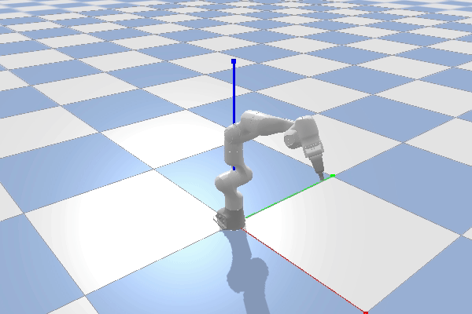
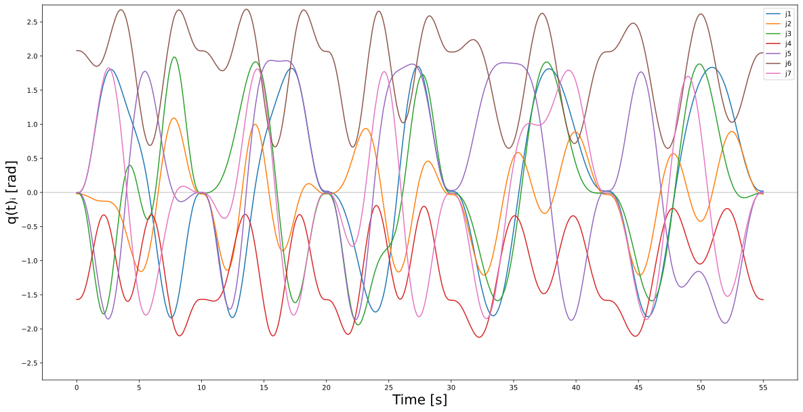
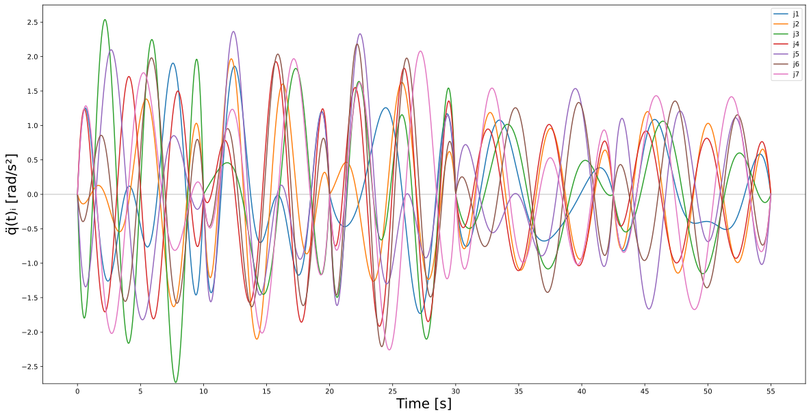
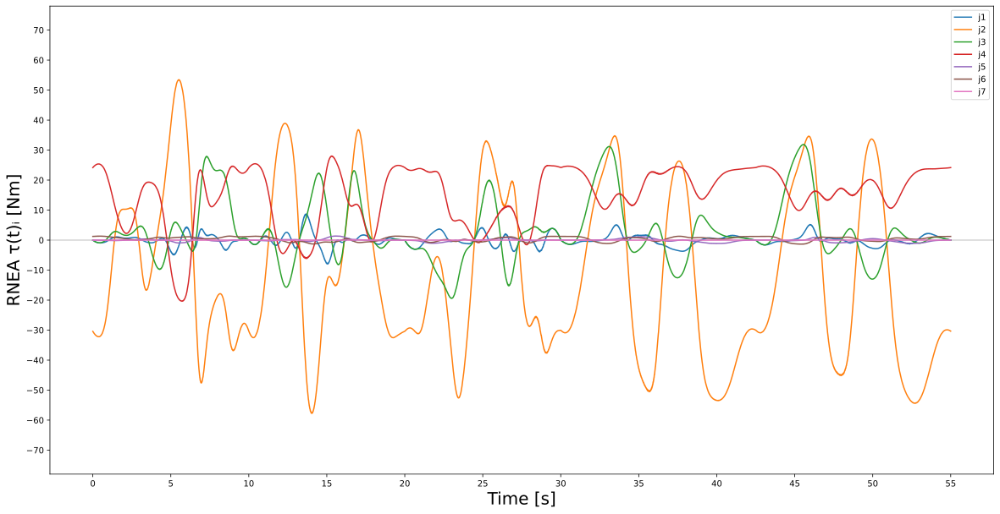

## PyBullet Simulation of the Franka Emika Panda 7-DOF Robot ##

--------------------------------------------------------------------------------

  
  <em> Visualization of the Franka Emika Panda in PyBullet Simulation</em>

--------------------------------------------------------------------------------

Simple simulation environment for the Franka Emika Panda 7-DOF robot. The project also includes the recording of a 55 seconds movement of the Franka Emika Panda with a mounted gripper that aimed to provide a well explored state space dataset as it also recorded the torque values applied by the robots control loop after having been corrected by its internal PID controller. The dataset can be found in 'movement_datasets/fep_state_to_pid-corrected-torque_55s_dataset.csv' and is recorded in radian at a sampling rate of 1000Hz, resulting in 55,000 data points. The dataset is visualized in the plots below.

Aside from the functionality to visualize a recorded FEP dataset does the project also provide the code to create simulated torque values based on PyBullet's internal inverse dynamics calculation via the Recursive Newton-Euler Algorithm (RNEA) as well as the option to perform gravity compensation in the simulation. PyBullets RNEA algorithm is calculated based on the FEP robot model description that was taken from Franka Emikas official ROS repository (see [here](https://github.com/frankaemika/franka_ros)) and was converted from .xacro to .urdf via ROS. In simulation is it possible to consider the dynamic effects of an end effector (a gripper in this project), though only the torques for the 7 joints of the body are recorded.

Further restrictions and specifications of the Franka Emika Panda that were considered in the simulation were taken from the official Franka Emika Panda Datasheet (see [here](https://s3-eu-central-1.amazonaws.com/franka-de-uploads/uploads/Datasheet-EN.pdf)).

Below you will find plots of the recorded robot state over the 55s movement as well as the PID corrected torque and the PyBullet RNEA simulated torque.

--------------------------------------------------------------------------------
#### Position Plot ####

  

--------------------------------------------------------------------------------
#### Velocity Plot ####

  

--------------------------------------------------------------------------------
#### Acceleration Plot ####

  

--------------------------------------------------------------------------------
#### PID-corrected Torque Plot ####

  

--------------------------------------------------------------------------------
#### PyBullet Simulated Torque Plot ####

  

